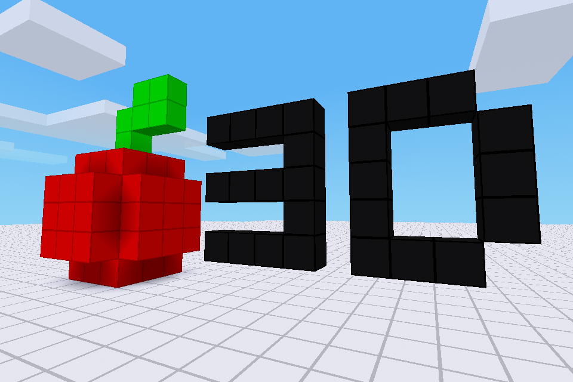

# Pixel Sandbox
A minimalist game for creating 3D pixel art.

# Colors
The game currently includes **8 color blocks**:
- Red
- Blue
- Yellow
- Green
- Orange
- Purple
- Black
- White
> More colors coming soon!

# World Generation
Only the `singlenode` world generator is available.
The world is large and flat, made of the block in the color selected in the settings.

# License
**Code**: LGPL-2.1-only
**Media**: CC-BY-SA-3.0
- Thanks to **celeron55** and various **Minetest Game** developers and contributors for the `player_api` mod
- Thanks to **TenPlus1** for the skin design idea
